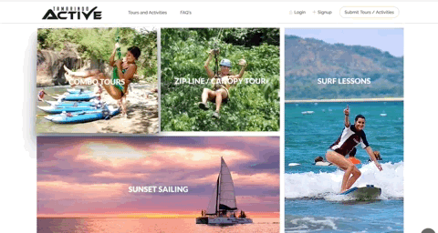
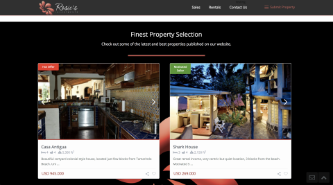
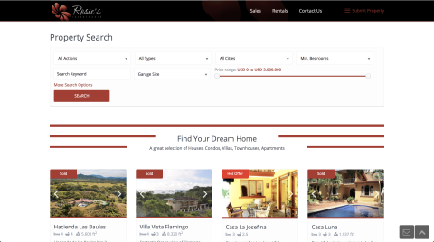
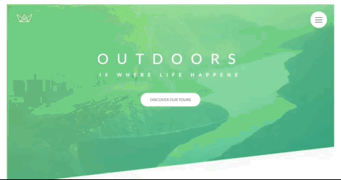
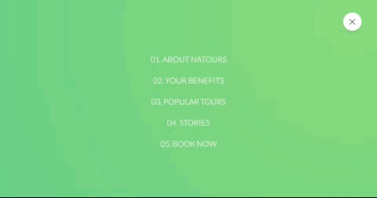
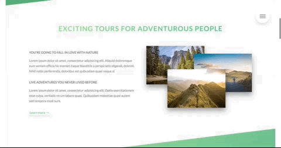
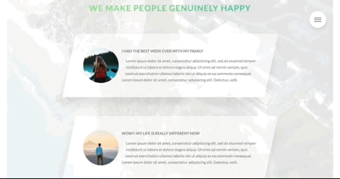
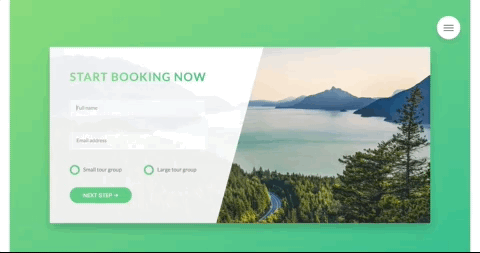

# Welcome to Stefano Monteiro GitHub Page

### Here is some of my favorites projects, enjoy! ###

## Personal Website

Get to know more about me.

 &nbsp;&nbsp;&nbsp;&nbsp;&nbsp;&nbsp;&nbsp;&nbsp; ℹ️  [See Code](https://github.com/stefanomonteiro/Personal-Website) &nbsp;&nbsp;&nbsp;|&nbsp;&nbsp;&nbsp; | 💻 [Visit Website](https://stefanomonteiro.github.io/Personal-Website/) - Still unfinished.

## Frogger - The Game

Projected created as part of Udacity's FrontEnd NanoDegree. [More info](https://github.com/stefanomonteiro/Frogger-Arcade-Game)

&nbsp;&nbsp;&nbsp;&nbsp;&nbsp;&nbsp;&nbsp;&nbsp; ℹ️  [See Code](https://github.com/stefanomonteiro/Frogger-Arcade-Game) &nbsp;&nbsp;&nbsp;|&nbsp;&nbsp;&nbsp; 🎮 [Play Game](https://stefanomonteiro.github.io/Frogger-Arcade-Game/)

## WordPress Themes

* [Tamarindo Active](www.tamarindoactive.com)

Edit and customize a Wordpress theme according to client requirements. The original theme intended as accommodation booking platform was transformed on a tours and activities booking platform.

 

&nbsp;
&nbsp;

* [Rosie's Investments](www.rosiesinvestiments.com)

Install and customize a Wordpress theme. Listen to client's business philosophy and specification to tweak the website accordingly.

 

## Sample Projects

* [Natours](https://stefanomonteiro.github.io/Natours/)

As part of a Advanced CSS and Sass course this project has the latests techniques in websites’ styling, animation and mobile devices responsiveness.

     