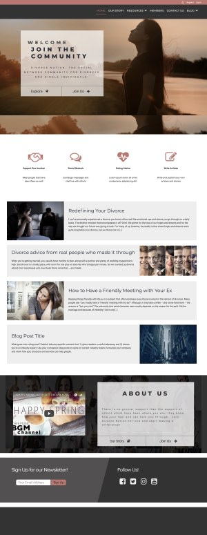
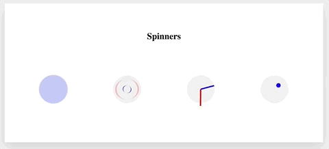

# Stefano Monteiro | Front-End Web Developer

## Personal Website

Get to know more about me.

&nbsp;&nbsp;&nbsp;&nbsp;&nbsp;&nbsp;&nbsp;&nbsp; ℹ️ [See Code](https://github.com/stefanomonteiro/Personal-Website) &nbsp;&nbsp;&nbsp;|&nbsp;&nbsp;&nbsp; 💻 [Visit Website](https://stefanomonteiro.github.io/Personal-Website/){:target="\_blank"} - Still unfinished.

## WordPress Design & Development

* ### [Divorce Nation](https://divorcenation.net/){:target="\_blank"}

  * Completely redesigned the Wordpress Theme.
  * Created a static HTML/CSS template from scratch and converted it in dynamic Wordpress page template.
  * Used Advanced Custom Fields to create a better UX for website owner when managing content in Wordpress Admin.
  * Added a new Custom Post Type.
  * Included front-end forms so subscribers can upload new blog posts as well as new custom post type.
  * Languages and Skills used: HTML, CSS, PHP, WP Functions, WP Template Tags, WP Custom Post Type, Advanced Custom Fields

  
  
  

- ### [Tamarindo Active](http://tamarindoactive.com/){:target="\_blank"}

  * Installed and customized a Wordpress theme according to client requirements.
  * Design and style using Visual Composer and Revolution Slider.
  * Adapted the theme accordingly to its business and industry.
  * Languages used: PHP, CSS

 

&nbsp;
&nbsp;

* ### [Rosie's Investments](http://www.rosiesinvestments.com/){:target="\_blank"}

  * Installed and customized a Wordpress using Visual Composer.
  * Listen to client's business philosophy and specification to tweak the website accordingly.
  * Languages used: PHP, CSS

 

## Educational Projects

* ### [Natours](https://stefanomonteiro.github.io/Natours/){:target="\_blank"}

As part of a Advanced CSS and Sass course this project has the latests techniques in websites’ styling, animation and mobile devices responsiveness.

     

* ### [Frogger - The Game](https://github.com/stefanomonteiro/Frogger-Arcade-Game){:target="\_blank"}

Projected created as part of Udacity's FrontEnd NanoDegree.

    -   HTML5 Canvas
    -   Javascript OOP
    -   CSS

&nbsp;&nbsp;&nbsp;&nbsp;&nbsp;&nbsp;&nbsp;&nbsp; ℹ️ [See Code](https://github.com/stefanomonteiro/Frogger-Arcade-Game){:target="\_blank"} &nbsp;&nbsp;&nbsp;|&nbsp;&nbsp;&nbsp; 🎮 [Play Game](https://stefanomonteiro.github.io/Frogger-Arcade-Game/){:target="\_blank"}

## Miscelaneous Fun Projects

* ### [Spinners](https://stefanomonteiro.github.io/Spinners/){:target="\_blank"}

ℹ️ [See Code](https://github.com/stefanomonteiro/Spinners){:target="\_blank"} | ▶️ [See Live](https://stefanomonteiro.github.io/Spinners/){:target="\_blank"}
