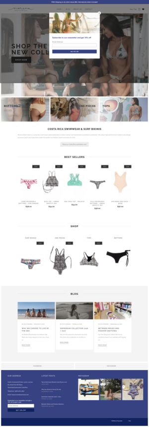

# Stefano Monteiro | Front-End Web Developer

## Projects from scratch

Designed and deveoped projects without the use of any CMS or templates.

- ### Personal Website - 2018

Get to know more about me.


&nbsp;&nbsp;&nbsp;&nbsp;&nbsp;&nbsp;&nbsp;&nbsp; ℹ️ [See Code](https://github.com/stefanomonteiro/Personal-Website) &nbsp;&nbsp;&nbsp;|&nbsp;&nbsp;&nbsp; 💻 [Visit Website](https://stefanomonteiro.github.io/Personal-Website/){:target="\_blank"} - Still unfinished.

- ### [Amore Paraiso](www.amoreparaiso.com){:target="\_blank} - 2018

  - Fully Optimized. Scores 99 on PageSpeed Insights and First Paint at ~700ms.
  - Images Optimized using Cloudinary CDN and the blur technique;
  - Used Advanced JavaScript to create a testimonial slider, fetch images from Instagram
    API, to activate sticky navigation bar and more;
  - Created a well styled Contact Form using CSS and PHP;
  - Applied Schema, Twitter Cards and Facebook Open Graphs markup;
  - Managed the development workflow with NPM and Webpack;
  - Languages and Skills used: HTML, CSS, Sass, JavaScript, jQuery, PHP, Webpack, NPM, Instagram API, Cloudinary;

  
  
  
  

## WordPress Design & Development

- ### [Morena Beachwear](https://morenabeachwear.com/){:target="\_blank"} - 2018

  - Completely redesigned the Wordpress Theme. Created a static HTML/CSS template from scratch and converted it in a dynamic Wordpress page template;
  - Used Advanced Custom Fields to create a better UX for website owner when managing content in Wordpress Admin;
  - Included front-end forms so subscribers can upload new blog posts as well as new custom post type;
  - Languages and Skills used: HTML, CSS, PHP, WP Custom Post Type, Advanced Custom Fields;

  
  

* ### [Divorce Nation](https://divorcenation.net/){:target="\_blank"} - 2017

  - Completely redesigned the Wordpress Theme. Created a static HTML/CSS template from scratch and converted it in a dynamic Wordpress page template;
  - Used Advanced Custom Fields to create a better UX for website owner when managing content in Wordpress Admin;
  - Included front-end forms so subscribers can upload new blog posts as well as new custom post type;
  - Languages and Skills used: HTML, CSS, PHP, WP Custom Post Type, Advanced Custom Fields;

  
  
  

- ### [Tamarindo Active](http://tamarindoactive.com/){:target="\_blank"} - 2017

  - Installed and customized a Wordpress theme according to client requirements;
  - Design and style using Visual Composer and Revolution Slider.
  - Created a child theme to tweak the template as needed;
  - Languages and Skills used: PHP, CSS, Visual Composer, Revolution Slider,
    Photoshop;

 

&nbsp;
&nbsp;

- ### [Rosie's Investments](http://www.rosiesinvestments.com/){:target="\_blank"} - 2016

  - Installed and customized a Wordpress theme according to client requirements;
  - Designed and styled the pages using Visual Composer and Revolution Slider;
  - Created a child theme to tweak the template as needed;
  - Languages and Skills used: PHP, CSS, Visual Composer, Revolution Slider,
    Photoshop;

 

## Educational Projects

- ### [Natours](https://stefanomonteiro.github.io/Natours/){:target="\_blank"}

As part of a Advanced CSS and Sass course this project has the latests techniques in websites’ styling, animation and mobile devices responsiveness.

     

- ### [Frogger - The Game](https://github.com/stefanomonteiro/Frogger-Arcade-Game){:target="\_blank"}

Projected created as part of Udacity's FrontEnd NanoDegree.

    -   HTML5 Canvas
    -   Javascript OOP
    -   CSS


&nbsp;&nbsp;&nbsp;&nbsp;&nbsp;&nbsp;&nbsp;&nbsp; ℹ️ [See Code](https://github.com/stefanomonteiro/Frogger-Arcade-Game){:target="\_blank"} &nbsp;&nbsp;&nbsp;|&nbsp;&nbsp;&nbsp; 🎮 [Play Game](https://stefanomonteiro.github.io/Frogger-Arcade-Game/){:target="\_blank"}

## Miscelaneous Fun Projects

- ### [Spinners](https://stefanomonteiro.github.io/Spinners/){:target="\_blank"}


ℹ️ [See Code](https://github.com/stefanomonteiro/Spinners){:target="\_blank"} | ▶️ [See Live](https://stefanomonteiro.github.io/Spinners/){:target="\_blank"}

- ### [Drum Kit](https://stefanomonteiro.github.io/drumkit-game/){:target="\_blank"}

I Made a game out of [Javascript 30](https://youtu.be/VuN8qwZoego?list=PLu8EoSxDXHP6CGK4YVJhL_VWetA865GOH){:target="\_blank"} first video tutorial by Wes Bos.


#### How the song animation works:

The music array is looped with a setTimeout function.

#### The music array:

It contains sub-arrays, each sub-array represents one music note. The animation above is represented by the following music array:

```
const music = [
  ['g', 71 , 3000],
  ['a', 65 , 4000],
  ['g', 71 , 5000],
  ['g', 71 , 5500],
  ['a', 65 , 6000],
  ['g', 71 , 7000],
  ['a', 65 , 8000],
  ['g', 71 , 9000],
  ['g', 71 , 9500],
  ['a', 65 , 10000]
];
```

Where:

    -   music[0] is a string of the keyboard key;
    -   music[1] is the keycode for music[0];
    -   music[2]is the delay for each animation from page restart;

ℹ️ [See Code](https://github.com/stefanomonteiro/drumkit-game){:target="\_blank"} | 🎮 [Play Game](https://stefanomonteiro.github.io/drumkit-game/){:target="\_blank"}
